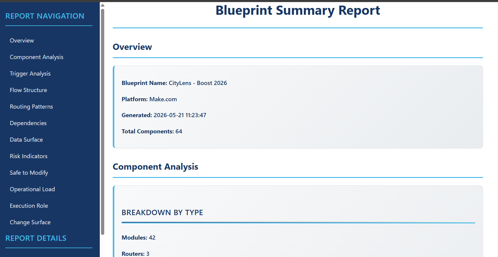
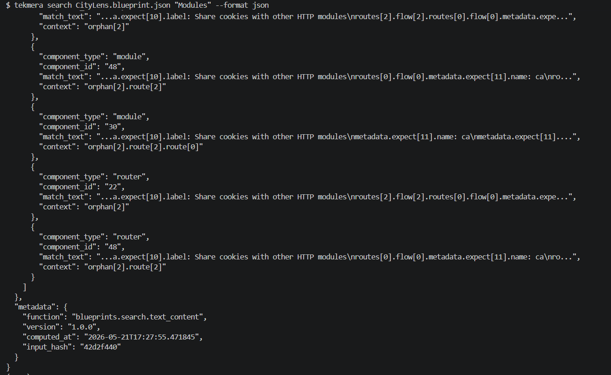
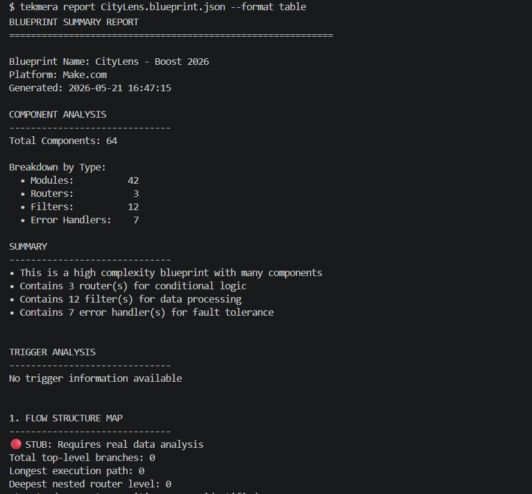

# Tekmera Fusion Explorer: An Intelligence Command-line Tool for Automation Analysis
| | |
| --- | --- |
| Packages | [](https://click.palletsprojects.com/) [](https://zepworks.com/deepdiff/) [](https://rich.readthedocs.io/) |
| Testing | [](https://pytest.org/) [](https://pytest-cov.readthedocs.io/) |
| Code Quality | [](https://black.readthedocs.io/) [](https://pycqa.github.io/isort/) [](https://flake8.pycqa.org/) [](https://mypy.readthedocs.io/) |
| Security & Audit | [](https://bandit.readthedocs.io/) [](https://github.com/pypa/pip-audit) |
| Build & Packaging | [](https://pyinstaller.org/) |

# What is it?
Tekmera Fusion Explorer is a command-line intelligence tool that analyzes exported automation "blueprint" JSON files (Workfront Fusion, Make.com, etc.) and turns them into searchable, auditable, and explainable reports. It helps integration teams discover field usage, module counts, differences between versions, and with an OpenAI API key setup — AI-generated natural-language summaries.

Table of Contents
-----------------
- [Main Features](#main-features)
- [Prerequisites](#prerequisites)
- [Installation / Setup](#installation--setup)
- [Usage (with Examples)](#usage-with-examples)
- [Screenshots](#screenshots)
- [Architecture / How it Works](#architecture--how-it-works)
- [Contributing](#contributing)
- [License](#license)
- [Contact / Acknowledgements](#contact--acknowledgements)

Main Features
-------------
- Analyze automation (Workfront Fusion and Make.com) blueprint JSON files with platform-aware parsing.
- Generate summary reports for a single blueprint in table, JSON, or HTML formats.
- Search text content across blueprint files to find modules, fields, and other references.
- Compare two blueprints to spot structural and behavioral differences.
- Use the CLI with built-in reporting for automation analysis workflows.

Prerequisites
-------------
- Python 3.8 or newer
- pip
- virtualenv (`venv`) or equivalent
- Optional (for Pro/AI features): an OpenAI API key

On Windows we recommend Git Bash or WSL for running the included shell scripts.

Installation / Setup
--------------------
Windows (PowerShell / Git Bash)
```powershell
# Clone the repo
git clone https://github.com/YOUR_ORG/tekmera-fusion-explorer.git
cd tekmera-fusion-explorer

# Create & activate a venv
python -m venv venv
venv\Scripts\activate

# Install dependencies and editable package
pip install -r requirements.txt
pip install -e .
```

macOS / Linux
```bash
# Clone
git clone https://github.com/YOUR_ORG/tekmera-fusion-explorer.git
cd tekmera-fusion-explorer

# Create & activate a venv
python3 -m venv venv
source venv/bin/activate

# Install
pip install -r requirements.txt
pip install -e .
```

Notes
- You can run `./scripts/init.sh` to perform interactive setup (license/API configuration).
- Do not commit secrets keys. Use environment variables for credentials.

Usage (with Examples)
---------------------
The `tekmera` CLI has several core commands. Examples below show common workflows.

- Generate a sample demo report (no input files required)
```bash
tekmera demo --platform workfront_fusion --format html
```

- Generate a one-page summary report for a single blueprint
```bash
tekmera report ./blueprints/name_of_file.json --format html
```

- Search across a directory of blueprints (up to 3 levels deep)
```bash
tekmera search ./blueprints/ "PI43"
tekmera search ./blueprints/ "PI\\d+" --regex --format json
```

- Compare two blueprints and produce a diff report
```bash
tekmera diff before.json after.json --format html
```

Interactive analysis
- Run `tekmera analyze /path/to/blueprints` to start the menu-driven explorer.

Output formats
- `table` (default), `json`, `html` — use `--format` to change the output.

Screenshots
-----------
<table>
	<tr>
		<td align="center"><strong>Html Output</strong></td>
		<td align="center"><strong>JSON Output</strong></td>
		<td align="center"><strong>Table Output</strong></td>
	</tr>
	<tr>
		<td align="center"></td>
		<td align="center"></td>
		<td align="center"></td>
	</tr>
</table>

Supported platforms
--------------------

| Platform | Module naming | Auto-detected from |
|----------|--------------|--------------------|
| Workfront Fusion | `workfront-service:action` | Module ID patterns |
| Make.com | `service:action`, `builtin:action` | Module ID patterns |

Blueprints are JSON exports from the respective platforms. See `CLAUDE.md` for the structural differences and sample shapes.

Architecture / How it Works
--------------------------
High-level components:

- `src/tekmera/functions/` — Pure functional engine that parses and normalizes blueprints by platform.
- `src/tekmera/reporting/` — Report composition (summary, diff) and sample renderers.
- `src/tekmera/clients/cli/` — Click-based CLI commands and formatters (`table`, `json`, `html`).

Typical flow:
1. Load blueprint JSON files (single file or directory).
2. Auto-detect platform and normalize structure (Workfront Fusion, Make.com, ...).
3. Extract modules, fields, routes, and metadata.
4. Compose summary, search results, or diffs in the reporting layer.
5. Optionally call AI summarization when an OpenAI key is configured.

For implementation details see `src/tekmera/` and `docs/architecture/README.md`.

Contributing
------------
Welcome and thank you for considering contributing to Tekmera Fusion Explorer! — please read the contributor guide: [CONTRIBUTING.md](CONTRIBUTING.md)


License
-------
Tekmera Fusion Explorer is open-source software licensed under the [MIT License](LICENSE).

Thank You!
--------------------------
- For more information, please contact David Kershaw at david@tekmera.ai